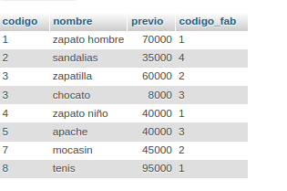
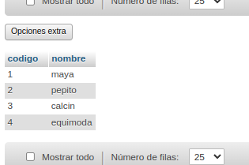

# creacion_BD_consultas

1. Creacion de una base de datos (BD) con MySQL usando phpmyadmin

## ZAPATERIA 

## CREACION DE TABLA 
### ARTICULO
|Campo|Tipo de dato|Longitud|
|-----|------------|--------|
|CODIGO|varchar|20|
|NOMBRE|varchar|20|
|PRECIO|varchar|25|
|CODIGO_FAB|varchar|20|

INSERT INTO `articulo` (`codigo`, `nombre`, `previo`, `codigo_fab`) VALUES ('1', 'zapato hombre', '70000', '1');

INSERT INTO `articulo` (`codigo`, `nombre`, `previo`, `codigo_fab`) VALUES ('2', 'sandalias', '35000', '4');

INSERT INTO `articulo` (`codigo`, `nombre`, `previo`, `codigo_fab`) VALUES ('3', 'zapatilla', '60000', '2');

INSERT INTO `articulo` (`codigo`, `nombre`, `previo`, `codigo_fab`) VALUES ('3', 'chocato', '8000', '3');

INSERT INTO `articulo` (`codigo`, `nombre`, `previo`, `codigo_fab`) VALUES ('4', 'zapato niño', '40000', '1');

INSERT INTO `articulo` (`codigo`, `nombre`, `previo`, `codigo_fab`) VALUES ('5', 'apache', '40000', '3');

INSERT INTO `articulo` (`codigo`, `nombre`, `previo`, `codigo_fab`) VALUES ('5', 'apache', '40000', '3');

INSERT INTO `articulo` (`codigo`, `nombre`, `previo`, `codigo_fab`) VALUES ('8', 'tenis', '95000', '1');

### FABRICANTE 

|Campo|Tipo de dato|Longitud|
|-----|------------|--------|
|CODIGO|varchar|20|
|NOMBRE|varchar|15|

INSERT INTO `fabricante` (`codigo`, `nombre`) VALUES ('1', 'maya');

INSERT INTO `fabricante` (`codigo`, `nombre`) VALUES ('2', 'pepito');

INSERT INTO `fabricante` (`codigo`, `nombre`) VALUES ('3', 'calcin ');

INSERT INTO `fabricante` (`codigo`, `nombre`) VALUES ('4', 'equimoda');

